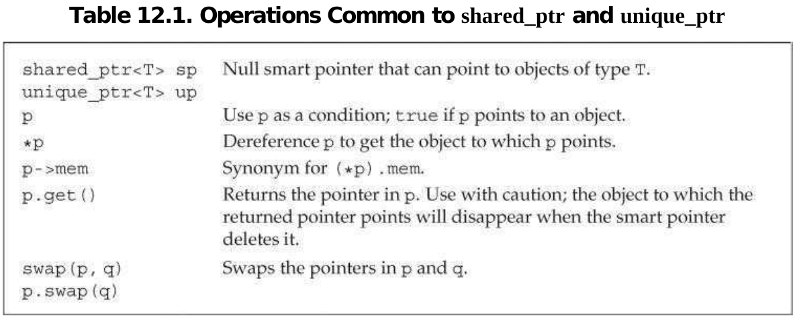
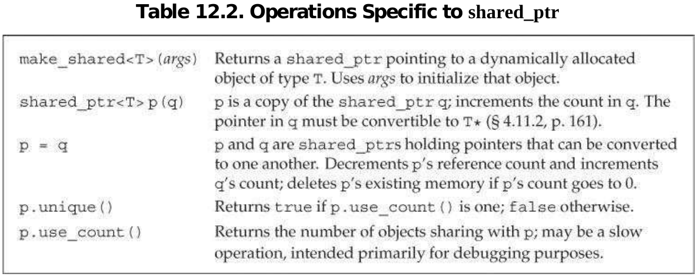
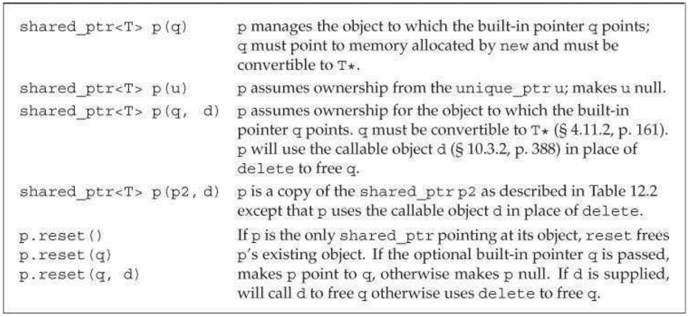
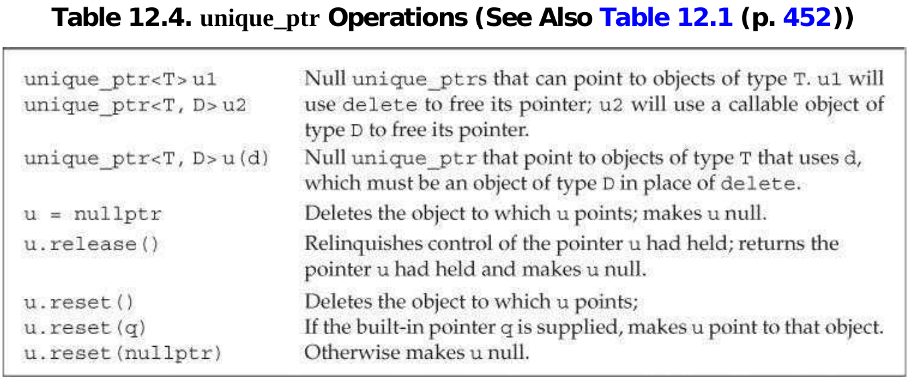
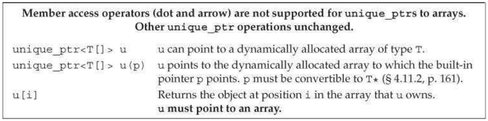

静态内存区用来存放局部`static`变量、class中的`static`成员变量、全局变量（定义在函数block之外的）。栈内存区用来存放定义在函数内部的非`static`变量。静态内存区和栈上的内存由编译器管理它们的生命周期。

而程序运行过程中动态申请的内存区都来自`free store`或堆。同时，动态申请的内存必须由程序自己显示的释放。C++中提供了一对operator来管理动态内存：`new` / `delete`；前者返回一个指针，后者删除指针所指的内存区域。

通过`new` / `delete`管理动态内存容易导致内存泄漏，或导致指针指向已经删除的内存区域。c++提供了新的用于管理动态内存的库`<memory>`，该库提供了两种类型的智能指针：`shared_ptr` / `unique_ptr`；以及一个由`shared_ptr`管理的companion class，`weak_ptr`。

## shared_ptr

`shared_ptr`和`vector`一样，属于模板类，所以在初始化的时候我们必须提供`type`。智能指针的使用与普通指针一样，下面列出了智能指针共有的常用的方法：



下面列出了`shared_ptr`特有的方法：



`make_shared<T>(args)`在动态内存上分配一块内存给object，用`args`初始化object后，返回指向object的共享指针。

```c++
// shared_ptr that points to an int with value 42
shared_ptr<int> p3 = make_shared<int>(42);
// p4 points to a string with value 9999999999
shared_ptr<string> p4 = make_shared<string>(10, '9');
// p5 points to an int that is value initialized (§ 3.3.1 (p. 98)) to 0
shared_ptr<int> p5 = make_shared<int>();
// p6 points to a dynamically allocated, empty vector<string>
auto p6 = make_shared<vector<string>>();
```

`make_shared`将`args`作为参数传入`T`的构造器中初始化object，如果不传参数，那么object则被默认赋值。

每个`shared_ptr`都有一个计数器，统计这个指针指向的object被多少个`shared_ptr`引用，即reference count。当我们对`shared_ptr`进行复制，赋值，删除等操作时，计数器会相应的增加或减少。以下情况会增加计数器：

- initialize another `shared_ptr`
- use it as a right-hand operand of an assignment
- pass it to or return it from a function

以下情况会减少计数器：

- assign a new value to it
- itself is destroyed, like out of the local scope

当计数器的值等于0时，共享指针自动释放其管理的内存。

### shared_ptr & new



需要传入指针作为参数的构造器都是`explicit`的，所以只能通过直接初始化（direct initialization）：

```c++
shared_ptr<int> p1 = new int(1024); // error: must use direct initialization
shared_ptr<int> p2(new int(1024)); // ok: uses direct initialization
```

第一行的写法，想要让编译器为我们将new返回的内置指针隐式的转化成智能指针，但是智能指针的构造器不允许隐式构造，所以编译器报错了；同样的，我们也不能隐式的返回内置指针：

```c++
shared_ptr<int> clone(int p) {
	return new int(p); // error: implicit conversion to shared_ptr<int>
    // ok: explicitly create a shared_ptr<int> from int*
	return shared_ptr<int>(new int(p));
}
```

### careful cases

当我们用智能指针绑定内置指针时，我们就像delete的责任交给了智能指针，一旦这样做了，我们就不应该再使用内置指针，因为我们无法知道内置指针是否还指向有效的内存：

```c++
int *x(new int(1024)); // dangerous: x is a plain pointer, not a smart
pointer
process(x); // error: cannot convert int* to shared_ptr<int>
process(shared_ptr<int>(x)); // legal, but the memory will be deleted!
int j = *x; // undefined: x is a dangling pointer!
```

传入`process()`的是一个临时参数，他将在函数调用后被删除，所以函数结束后，reference count = 0，对应的内存就会被删除，x指向了无效的内存（dangling pointer）。

如果要使用智能指针的`get()`方法，那么一定要保证，使用`get()`返回的内置指针的函数主体中，不会delete内置指针，否则，智能指针就变成了dangling pointer。

```c++
shared_ptr<int> p(new int(42)); // reference count is 1
int *q = p.get(); // ok: but don't use q in any way that might delete its
pointer
{ // new block
// undefined: two independent shared_ptrs point to the same memory
shared_ptr<int> p2(q);
} // block ends, q is destroyed, and the memory to which q points is freed
int foo = *p; // undefined; the memory to which p points was freed
```

新的block内部，通过p返回的内置指针作为参数构造的新的智能指针p2，与p是相互独立的，它们内部的reference count都等于1。所以当block结束后，p2的reference count变为0，p2就delete了q所指向的内存，而这也是p所指向的内存，则p就变成了dangling pointer。

> Use get only to pass access to the pointer to code that you know will not delete the pointer. In particular, never use get to initialize or assign to another smart pointer.

当我们需要对共享的对象进行修改时，为了不影响其他的智能指针，我们必须在修改前确保我们是唯一的指针，否则我们改变指针的指向，让其指向这个对象的copy，然后对其进行修改：

```c++
if (!p.unique())
	p.reset(new string(*p)); // we aren't alone; allocate a new copy
*p += newVal; // now that we know we're the only pointer, okay to change this object
```

当对象的reference count等于0时，智能指针会自动帮我们delete；另一个好处是，当函数因为异常结束时，智能指针也会帮我们清理现场，delete对应的内存，如果我们使用内置指针，那么异常发生后，代码就不会继续运行，即不会运行delete代码。

```c++
void f()
{
	shared_ptr<int> sp(new int(42)); // allocate a new object
	// code that throws an exception that is not caught inside f
} // shared_ptr freed automatically when the function ends

void f()
{
	int *ip = new int(42); // dynamically allocate a new object
	// code that throws an exception that is not caught inside f
	delete ip; // free the memory before exiting
}

```

### deleter

### summary

- Don’t use the same built-in pointer value to initialize (or reset) more than one smart pointer.
- Don’t delete the pointer returned from get().
- Don’t use get() to initialize or reset another smart pointer.
- If you use a pointer returned by get(), remember that the pointer will become invalid when the last corresponding smart pointer goes away.
- If you use a smart pointer to manage a resource other than memory allocated by new, remember to pass a deleter 

### weak_ptr

弱指针并不能管理它所指向的内存对象的生命周期，弱指针通过与共享指针绑定，从而由共享指针管理对应的内存对象的生命周期；但是弱指针不会增加reference count。下面是弱指针常用的操作函数：


weak_ptr无法知道它指向的对象是否还存在，所以我们在使用它指向的对象前，需要调用`wp.lock()`获得对象的`shared_ptr`。

```c++
if(shared_ptr<int> np = wp.lock()) {} // true if np is not null
```

## unique_ptr

unique_ptr拥有它指向的内存对象，这个内存对象不与其他指针共享，下面是常用的函数：



unique ptr没有像`make_shared`的创建智能指针的方法，我们可以直接申明或者将其与内置指针绑定：

```c++
unique_ptr<double> p1; // unique_ptr that can point at a double
unique_ptr<int> p2(new int(42)); // p2 points to int with value 42
```

因为独占指针独占指向的内存对象，所以独占指针没有赋值或复制的操作。但是我们可以通过`release()`或`reset()`转移我们的占有权：

```c++
// transfers ownership from p1 (which points to the string Stegosaurus) to p2
unique_ptr<string> p2(p1.release()); // release makes p1 null
unique_ptr<string> p3(new string("Trex"));
// transfers ownership from p3 to p2
p2.reset(p3.release()); // reset deletes the memory to which p2 had pointed
```

如果我们没有手动的释放掉`release()`返回的内置指针，那么我们将无法再获取这个指针：

```c++
p2.release(); // WRONG: p2 won't free the memory and we've lost the pointer
auto p = p2.release(); // ok, but we must remember to delete(p)
```

### deleter

## new & delete

C++提供了一对操作符new / delete，可以允许程序员申请动态内存以及释放动态内存。需要注意的是，内置类型的默认初始化值为`undefined`，但是通过值初始化（value initialized），则为类型的值默认值：

```c++
string *ps1 = new string; // default initialized to the empty string
string *ps = new string(); // value initialized to the empty string
int *pi1 = new int; // default initialized; *pi1 is undefined
int *pi2 = new int(); // value initialized to 0; *pi2 is 0
```

我们也可以用new来为`const`对象分配动态内存：

```c++
// allocate and initialize a const int
const int *pci = new const int(1024);
// allocate a default-initialized const empty string
const string *pcs = new const string;
```

delete ptr可以释放ptr指向的动态分配内存空间，需要注意的是，ptr必须指向动态分配内存空间或者`nullptr`：

```c++
int i, *pi1 = &i, *pi2 = nullptr;
double *pd = new double(33), *pd2 = pd;
delete i; // error: i is not a pointer
delete pi1; // undefined: pi1 refers to a local
delete pd; // ok
delete pd2; // undefined: the memory pointed to by pd2 was already freed
delete pi2; // ok: it is always ok to delete a null pointer
```

通过new申请的动态内存除非被显示的delete，则会一致存在，造成内存泄漏。

## dynamic arrays

关键字new只能为一个单独的对象分配内存空间，如果我们希望为一组对象分配连续的内存空间，就要这么写：

```c++
int *ca = new int[5]; // default initialize, block of 5 undefined int
int *ca2 = new int[5](); // value initialize, block of 5 zero ints
int *ca3 = new int[5]{1,2,3,4,5};
```

删除一组动态分配的连续内存空间，也需要特别的写法：

```c++
delete [] ca;
```

c++库允许我们通过unique_ptr管理一组动态内存：

```c++
// up points to an array of ten uninitialized ints
unique_ptr<int[]> up(new int[10]);
up.release(); // automatically uses delete[] to destroy its pointer
// access dynamic array
for(size_t i = 0;i<10;++i){
    up[i] = i;
}
```

常用的与动态数组有关的方法：



如果希望通过shared_ptr管理一组动态内存空间，我们在创建共享指针时需要自己提供deleter；同时，我们无法通过下标直接访问共享指针，共享指针也不支持指针运算(*p++)，所以要注意写法：

```c++
// to use a shared_ptr we must supply a deleter
shared_ptr<int> sp(new int[10], [](int *p) { delete[] p; });
sp.reset(); // uses the lambda we supplied that uses delete[] to free the array
// shared_ptrs don't have subscript operator and don't support pointer arithmetic
for (size_t i = 0; i != 10; ++i)
	*(sp.get() + i) = i; // use get to get a built-in pointer
```

## Questions

- value initialized / direct initialized / default initialized

